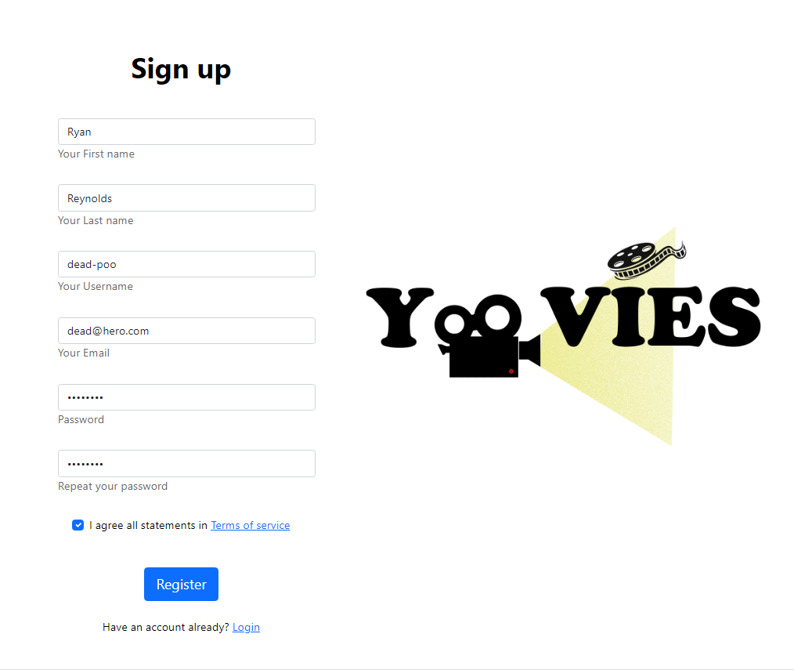
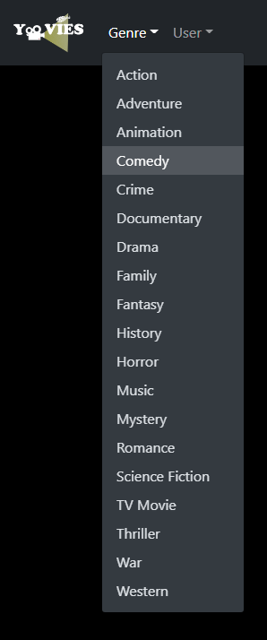
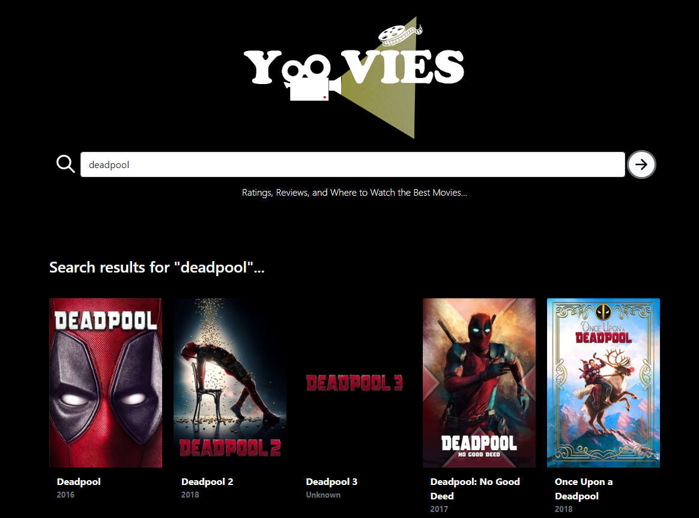
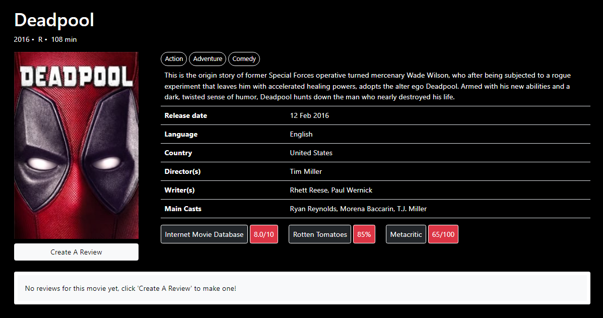
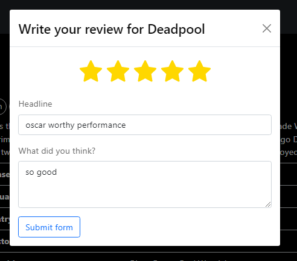

# Yoovies

### Team members 
- Kelly Jiang
- Lander Nunez
- Matthew Oshimo
- Myolin (Myo) Kha
- Nikansha Maharaj

### Summary
The goal for Yoovies is to provide a platform for film lovers and moviegoers to share their opinions on what they've watched. Everyone has an opinion, we want to provide a platform to allow people to share theirs with others. 

### Target Audience
Our target audience are film lovers and moviegoers who want to (and love to) share their movie reviews and recommendations or are looking for reviews and recomendations on what to watch next.

### Design
* [API design](docs/apis.md)
* [Data model](docs/data-model.md)
* [GHI](docs/ghi.md)
* [Integrations](docs/integrations.md)

### Functionality
- Users will be able to signup for an account. 
- Once users signup for an account they will be able to login, logout, and update their profile details.  
- Users who are logged in will also be to create reviews for each movie, if a user is not logged in they will be redirected to the login page when trying to create a review. 

- The homepage shows a list of the day's trending movies and will refresh each day - it will show a list of each movie with the name, title, year and poster for that movie.
- Users can also find a movie by searching for it in the search bar or by browsing different genres e.g. Comedy, Mystery, Action, etc...

- When a user clicks on a movie poster on the homepage, they will be redirected to a movie detail page which will list details such as:
    - the movie's genre(s) / genre tags
    - a brief synopsis
    - release date
    - language
    - country
    - director(s)
    - writer(s)
    - main cast
    - ratings from IMDB, Rotten Tomatoes, and Metacritic
    - users can also 'Create A Review' as well as read reviews from other users

### Project Initialization
You can either use the deployed link or please follow the instructions to open Yoovies on your local machine. 

##### Deployed
We recommend using the deployed version to view & use Yoovies: https://yoovies.gitlab.io/yelp-for-movies/

##### Local Machine (for instructors)
If you would rather download Yoovies to your local machine, please follow these steps, you'll need to use your terminal and Docker Desktop. 

1. Clone the repository down to your local machine
2. CD into the new project directory (yelp-for-movies)
3. You'll need to copy/paste the keys (located in the Settings => CI/CD => Variables) into a .env file using the following format:
    - REACT_APP_TMDB_API_KEY=key value
    - REACT_APP_OMDB_API_KEY=key value
    - DJWTO_SIGNING_KEY=key value
4. RUN the command: *docker volume create yovies-data*
5. RUN the command: *docker compose build*
6. RUN the command: *docker compose up*
7. Open Docker Desktop, all of your containers should be up and running 

### Navigating Yoovies
1. In the navigation bar, select User, then Signup for an account.
    &nbsp; 
    
    &nbsp;
    
&nbsp;
&nbsp;
2. Once you've signed up for an account, you can now create movie reviews. You can find movies by genre or by searcing for movies in the search bar. 
    &nbsp;
    
    &nbsp;
    
&nbsp;
&nbsp;
3. Select a movie, read the details, then select 'Create a Review'
    &nbsp;
    
&nbsp;
&nbsp;
4. Once you complete your review, hit 'Submit form' & find more of your favorite movies to review!
    &nbsp;
    